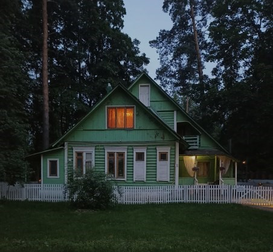

# Peredelkino-the-voice-of-contemporaries

<table style="border:none; border-collapse: collapse; width:100%; background:transparent;">
  <tr style="border:none;">
    <td width="40%" style="border:none; padding:0;">
      
    </td>
    <td width="60%" style="border:none; padding-left:20px; vertical-align:top;">
      <h3 style="margin-top:0; color:#2c3e50; font-family:Georgia,serif;">Peredelkino Residents & Reviews Visualization</h3>
      

        Peredelkino - a truly powerful place weaving the lace of human destinies. This is a place of inspiration, formation and birth of creators of new artistic life. The boiling creative energy reflects in the life of everyone who ever finds themselves in this place of power.
      

      

        The project visualizes data about Peredelkino residents and visitors' reviews, capturing the unique cultural atmosphere of this legendary writers' colony through interactive dashboards and archival materials analysis.
      

    </td>
  </tr>
</table>
